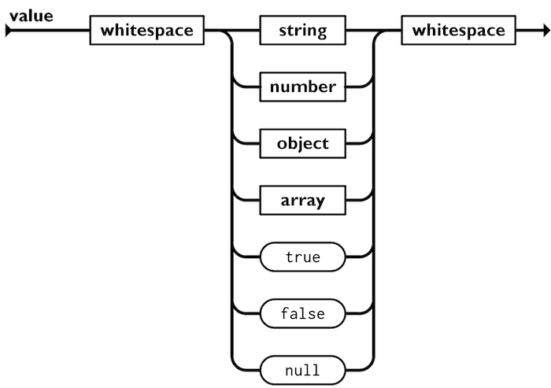

[Zurück](01_Motivation.md)

## 2. Über JSON


<p align="center">Abbildung 1: JSON Logo<br>
(Quelle: https://www.cleanpng.com/png-json-svg-761162/)
</p>


### Überblick

JSON (JavaScript Object Notation) ist ein Open Source Datenaustauschformat, das für Menschen einfach zu lesen, zu schreiben und für Maschinen einfach zu parsen und zu generieren ist. Es basiert auf einer Untermenge von JavaScript. Bei JSON handelt es sich um ein Textformat, das komplett unabhängig von Programmiersprachen ist. [1] Parser und Generatoren existieren für die meisten verbreiteten Programmiersprachen. JSON hat sich in den letzten Jahren als “das Format” für Datenübertragung im Web etabliert und damit XML aus dieser Position verdrängt. [3] Das liegt besonders an JSON’s schlanker Struktur und einfacher Lesbarkeit.

JSON wurde ursprünglich Anfang der 2000er Jahren von Douglas Crockford spezifiziert. Erstmals standardized wurde es dann in 2013, als ECMA-404. Seit Ende 2017 wird es durch zwei unterschiedliche, inhaltlich aber gleiche, Standards spezifiziert – RFC 8259 sowie weiterhin durch ECMA-404. [3] 


### Entstehung

JSON entstand aus der Notwendigkeit eines zustandslosen Echtzeit-Kommunikationsprotokolls zwischen Server und Browser, das ohne Browser-Plugins wie Flash oder Java-Applets funktionierte. Deren Verwendung war bei den in den frühen 2000er Jahren vorherrschenden Lösungen bisher nötig. [4]

Die Entstehungsgeschichte von JSON ist in der Hinsicht besonders, dass die Technologie nicht von einer einzelnen Person oder einem Team “erfunden” wurde, wie sonst oft üblich. Denn JSON stellt in dem Sinne keine eigene Technologie dar, sondern nur eine bestimmte Nutzungsform bestehender Technologie, nämlich die Nutzung von JavaScript Objekt-Literalen zum Datenaustausch. Douglas Crockford, der mit einem ersten Test 2001 als “Finder” dieser Nutzungsmethode gilt, gab selbst an, dass bereits 1996 ein Netscape-Mitarbeiter diese Idee gehabt und genutzt habe. [1] In den untersuchten Quellen wurde hierzu leider nicht mehr aufgeführt. Crockfords erster Versuch ist hingegen gut dokumentiert. Im April 2001 schickten Crockford und Chip Morningstar die erste JSON-Nachricht:

```yaml
<html><head><script> 
	document.domain = 'fudco';  
	parent.session.receive(    
		{ to: "session," do: "test,"     
		text: "Hello world" }  
	)
</script></head></html>
```
[3]

Die Nachricht ist an sich html mit etwa JavaScript, denn JSON ist, wie bereits gesagt, ein Subset von JavaScript. Wichtig war, dass Morningstar und vor allem Crockford das Potenzial dieses Prinzips zur Nutzung im Datenaustausch erkannten.Sie gaben ihm den Namen JSON und begannen es ihren Kunden vorzustellen. Crockford hatte einflussreiche Rollen bei großen dotcom Unternehmen, wie PayPal und somit Möglichkeiten, JSON zu verbreiten. Es zeigte sich aber schnell, dass Kunden, trotz der offensichtlichen Vorteile, vor der Nutzung zurückschreckten, weil JSON keine Spezifikation besaß. [3] Aus diesem Grund schrieb Crockford selbst eine, die er ab 2002 unter der Domain json.org zur Verfügung stellte. Seitdem musste er nicht viel mehr tun. Die Community baute selbst die Parser Implementierungen für eine Vielzahl von Programmiersprachen auf. 2013 erfolgte die ECMA Standard Ratifizierung und und 2017 eine RFC Standardisierung.


### Aufbau und Funktionen

**JSON baut auf zwei Strukturen auf:**

- Key-Value Paare: In verschiedenen Sprachen wird dies realisiert als ein Objekt (object), Satz (record), Struktur (struct), Wörterbuch bzw. Verzeichnis (dictionary), Hash-Tabelle (hash table), Schlüssel-Liste (keyed list) oder als ein assoziatives Array (associative array). [2]
- Eine geordnete Liste von Werten: In den meisten Sprachen wird das als Array (array), Vektor (vector), Liste (list) oder Sequenz (sequence) realisiert. [2]

Zur Zeichenkodierung wird standardmäßig UTF-8 verwendet, aber UTF-16 und 32 sind auch möglich.

**JSON kennt die folgenden grundlegenden Typen von Elementen:**

- Strings (Zeichenketten, Start und Ende immer markiert durch doppelte Anführungszeichen “...” ) 
- Numbers 
- Booleans (true, false)
- null
- Arrays ( Start und Ende immer markiert durch eckige Klammern [...])
- Objects (Start und Ende immer markiert durch geschweifte Klammern {...})

[2]

Wichtig für die Flexibilität von JSON ist, diese Elemente können ineinander verschachtelt werden. Die obige Liste von Elementen bringt auch Einschränkungen mit sich. 

**Einschränkungen:**

- NaN, Infinity und -Infinity werden zu null serialisiert.
- Date-Objekte werden als String in das ISO-8601-Format konvertiert.
- Function-, RegExp- und Error-Objekte werden verworfen.

Natürlich werden in Programmiersprachen und Datenbanken immer mehr Datentypen benötigt, als diese Basiselemente liefern können. Und so werden dort entsprechende Erweiterungen/Lösungen implementiert, um auch diese speichern/verarbeiten zu können, aber es ist gut, dass diese nicht in JSON an sich mit aufgenommen werden. Denn nur so behält es seine einfache Struktur, die es so erfolgreich gemacht hat.




[Weiter](03_Ueber_PostgreSQL.md)

