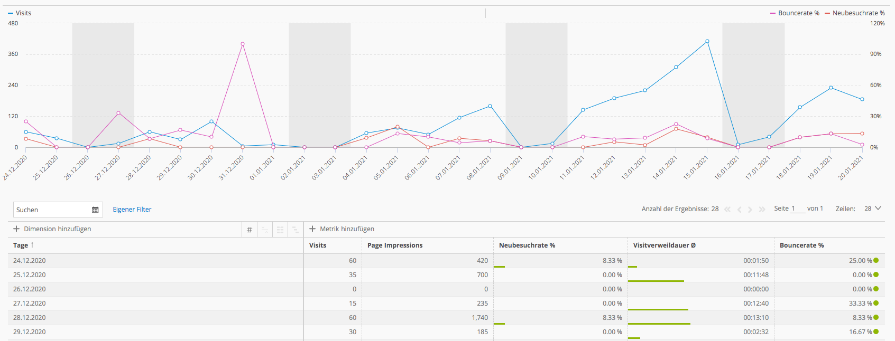

[Zurück](05_Vergleich_der_JSON_Verarbeitung.md)

## 6. Fazit

### Empfehlungsszenario für JSON Verarbeitung mit Postgres

Wie schon in den vorherigen Kapiteln deutlich wurde, ist es kaum möglich oder sinnvoll absolute Aussagen zu treffen, wann MongoDB oder Postgres verwendet bzw. nicht verwendet werden sollten. Es gibt jedoch Anhaltspunkte, die eine Entscheidung leichter machen können.

Immer wieder kommt es zu Datenmodellen, wo sowohl SQL- und NoSQL-Datenbanken parallel verwendet werden. Oft wird eine bestehende SQL-Lösung um NoSQL DBs erweitert, weil NoSQL Funktionen benötigt werden. Postgres bietet hier mit dem umfassenden JSON Support eine Möglichkeit das Datenmodell einfacher zu halten und Komplexität zu vermeiden, indem auf weitere NoSQL Datenbanken verzichtet werden kann. Die Datensatzgröße, Datennutzungsmuster und Infrastruktur sind weitere wichtige Aspekte. Postgres eignet sich in der Regel besser für große Datenbestände mit definierten Strukturen. Es wird also bei länger laufenden und skalierenden Produkten immer attraktiver. Bei der Abfrage von Daten ist es vorteilhaft für die Performance, wenn der Use Case so aussieht, dass jeweils komplett auf den RAM des Servers, wird die Performance noch einmal deutlich besser. 

Wird Postgres konkret in Erwägung gezogen, geht es um die Frage JSON oder JSONB und welche Indexierung. JSONB ist hier aufgrund des vollen Supports an Funktionen und Full-Text-Search eigentlich immer die bessere Wahl, es sei denn der Use Case erfordert explizit, dass die Daten nur im Original JSON Format gespeichert werden und dauerhaft nur wenig komplexe Abfragen zu erwarten sind. Der Punkt Indexierung hält wiederum einen Punkt bereit, der für JSONB spricht. Die Wahl von GIN-Index ist nur hier möglich und bietet erhebliche Vorteile, was die Performance angeht. Nur, wer sehr knapp unterwegs ist, was Speicherplatz angeht, muss hier wissen, dass der Index merkbar zusätzlichen Speicherplatz benötigt. Aber, wer die Wahl für Postgres trifft, hat auch noch dafür Platz, weil er höchstwahrscheinlich nicht nach einer besonders platzsparenden DB sucht.

Auch im Bereich Analytics kommt man um den Einsatz einer relationalen Datenbank kaum herum. Analytics vergleicht Daten und trifft auf diesen Auswertungen Aussagen darüber, wie sich definierte Key Performance Indikatoren (KPIs) entwickeln. Dies kann im zeitlichen Bezug stehen oder auch im direkten Vergleich mit anderen Faktoren wie verschiedene Webseiten, Kampagnen, Zielgruppen etc. Um diese Vergleichbarkeit zu schaffen und sich außerhalb der eigenen Unternehmens an branchenweiten Benchmarks zu orientieren ist es unumgänglich ein klar definiertes Datenschema als Grundlage zu haben. Nur so kann sichergestellt werden, dass jede Dimension das gleiche Verständnis der standardisierten Metriken hat und Äpfel nicht mit Birnen verglichen werden.

### Empfehlungsszenario für JSON Verarbeitung mit MongoDB

Bei der Beschreibung eines Empfehlungsszenarios für die JSON Verarbeitung mit MongoDB muss zunächst berücksichtigt werden, dass MongoDB die Objekte als BSON darstellt. Diese Vorgehensweise und die Gründe dafür wurden im Hauptteil näher ausgeführt. Nichtsdestotrotz kann man von einem Empfehlungsszenario für die JSON Verarbeitung mit MongoDB sprechen, man sollte dieses Detail jedoch im Hinterkopf behalten. In der eigentlichen Handhabung macht es keinen großen Unterschied und der Anwender wird die Darstellung in BSON als natürlich empfinden. 

Im Verlauf dieser Hausarbeit wurde ausführlich dargelegt, dass MongoDB aus dem Wunsch heraus entwickelt wurde eine Datenbanklösung für Skalierbarkeit und größtmögliche Flexibilität zu finden. Und genau dort liegt die Stärke von MongoDB. Der Einsatz von MongoDB ist unkompliziert, schnell, flexibel und skalierbar. Auf der anderen Seite müssen Faktoren wie Datenintegrität, Sicherheitsprüfungen und das fehlende einheitliche Datenschema stets bedacht werden. Wie im vorherigen Abschnitt beschrieben, bietet bei ausgereiften Projekten, bei denen definierte Strukturen nötig sind, eine Umsetzung mit Postgres deutliche Vorteile.

Die Nutzung von MongoDB ist dahingegen in folgenden Szenarien gegenüber der einer Nutzung von relationalen Datenbanken überlegen:

1. Bei der Entwicklung von Prototypen, bei denen das Projekt noch nicht ausgereift ist und daher nicht alle Datendetails bekannt sind. 
2. In modernen Applikationen, bei denen Datensätze flexibel gehandhabt werden müssen.
3. Im Falle, dass Endnutzer Änderungen an ihren Daten (inklusive Datenfeldern) vornehmen können. 
4. Wenn die Umsetzung unter Zeitdruck zu erfolgen hat und die Einarbeitung in den kompletten Projektrahmen nicht möglich ist. 

### Abschlusswort

In dieser Hausarbeit wurde ein detaillierter Einblick in das Datenformat JSON gegeben und im Anschluss die Entstehung der relationalen Datenbank Postgres, sowie der nicht relationalen Datenbank MongoDB betrachtet. Beide Datenbanken wurden in der Verarbeitung von JSON Objekten geprüft und verglichen und mit einem Erfahrungsbericht die Umsetzung in der Wirtschaftspraxis beleuchtet. Alles in allem ist deutlich geworden, dass beide Datenbanktypen ihre Vor- und Nachteile haben, aber beide in der Verarbeitung von JSON Objekten technisch ausgereift und leistungsstark agieren. Am Ende ist das Anwendungsszenario ausschlaggebend, um eine passende Wahl zwischen Postgres und MongoDB treffen zu können. 

[Weiter](07_Literaturverzeichnis.md)

